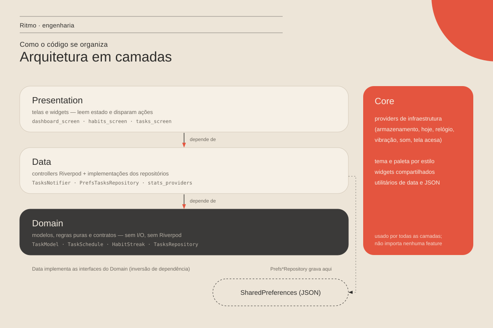

<div align="center">


# Daily Flow

**Hábitos, tarefas e foco em um app só — offline, sem conta, sem anúncios.**

[](https://github.com/Rick-Henrique7/Daily-Flow/actions/workflows/ci.yml)


[O app](#o-app) · [Engenharia](#engenharia) · [Como rodar](#como-rodar) · [Documentação](docs/README.md)

</div>

---

## O app

Uma tela responde "o que eu preciso fazer hoje e quanto já fiz". Tudo fica no
aparelho: nenhum cadastro, nenhum dado enviado para fora.

- **Hoje:** progresso do dia somando hábitos e tarefas, e conclusão em um
  toque.
- **Hábitos:** calendário mensal, frequência por dia da semana, sequência
  calculada e dias perdidos em destaque.
- **Tarefas:** pontuais ou recorrentes (a recorrente volta pendente no
  próximo dia previsto), tarefa atrasada continua visível até ser feita,
  prioridade e abas Todas / Hoje / Próximas /
  Concluídas.
- **Foco:** Pomodoro 25 / 5 / 15 com ciclo automático. O tempo segue certo
  mesmo com o app minimizado, e a tela fica acesa enquanto roda.
- **Estatísticas:** tarefas concluídas, minutos de foco, gráfico por
  semana / mês / ano e mapa de 8 semanas de hábitos.
- **Avisos:** resumo da manhã, pendências da noite, horário de tarefas e
  hábitos, com **Concluir** e **Adiar 1 h** na própria notificação. Tudo
  agendado no aparelho.
- **Dois estilos:** *Editorial* (papel creme, tinta grafite, coral) e
  *Liquid Glass* (vidro translúcido), com cores personalizáveis.

<!--
Capturas de tela: salve em docs/screenshots/ e descomente a tabela.

| Hoje | Hábitos | Tarefas | Foco |
| --- | --- | --- | --- |
|  |  |  |  |
-->

## Engenharia

O projeto começou como app pessoal e foi refatorado em
[etapas documentadas](docs/refatoracao/README.md), a partir de uma
[revisão de arquitetura](docs/refatoracao/revisao-de-arquitetura.md)
guiada por SOLID e Clean Code.



| | |
| --- | --- |
| **Arquitetura** | Por feature, com camadas `presentation` → `data` → `domain`. `core/` não depende de nenhuma feature, e o CI verifica essa regra. [Detalhes](docs/arquitetura.md) |
| **Domínio puro** | Regras como "o que é de hoje", sequência de hábitos, estatísticas e ciclo do foco são funções puras, sem Flutter e sem I/O. [ADR 0004](docs/adr/0004-regras-de-dominio-puras.md) |
| **Inversão de dependência** | Controllers dependem de interfaces de repositório. Armazenamento, relógio, som e vibração são injetados pelo Riverpod e trocados por fakes nos testes. |
| **Testes** | 86 testes automatizados (80 unitários + 6 de widget), com data e relógio fixos. Cada bug corrigido tem um teste de regressão. [Estratégia](docs/qualidade/testes.md) |
| **CI** | GitHub Actions a cada push e PR: análise estática, regras de arquitetura e testes com cobertura. |
| **Decisões registradas** | 8 [ADRs](docs/adr/README.md): repositórios, paleta como `ThemeExtension`, timer pelo horário de término e outras. |
| **Requisitos** | 47 funcionais e 10 não funcionais, com critérios de aceite, [casos de uso](docs/requisitos/casos-de-uso.md) e [matriz de rastreabilidade](docs/requisitos/rastreabilidade.md) até o teste. |
| **Processo** | Branches por etapa, Conventional Commits, SemVer, CHANGELOG e critérios de pronto. [Ciclo de vida](docs/processo/ciclo-de-vida.md) |

Um exemplo do que a refatoração resolveu: o timer de foco atrasava quando o
Android pausava o app em segundo plano. Agora ele guarda o horário de término
e calcula o restante pelo relógio, e um teste com relógio falso prova isso
sem esperar 25 minutos
([ADR 0007](docs/adr/0007-timer-pelo-horario-de-termino.md)).

### Stack

Flutter · Dart 3 · Riverpod 2 · go_router · SharedPreferences (JSON) ·
Syncfusion Calendar · liquid_glass_widgets · audioplayers · wakelock_plus ·
GitHub Actions

## Como rodar

Pré-requisitos: [Flutter](https://docs.flutter.dev/get-started/install) 3
(Dart ≥ 3.11) e Android SDK.

```bash
git clone https://github.com/Rick-Henrique7/Daily-Flow.git
cd Daily-Flow/gestao_pessoal
flutter pub get
flutter test        # 86 testes
flutter run         # com um aparelho ou emulador conectado
```

Build de release: `flutter build appbundle --release`. Assinatura e
publicação estão no [processo de release](docs/processo/ciclo-de-vida.md#4-processo-de-release-android).

## Estrutura

```text
Daily-Flow/
├── .github/workflows/ci.yml   integração contínua
├── docs/                      requisitos, arquitetura, ADRs, testes, processo
└── gestao_pessoal/            app Flutter
    ├── lib/
    │   ├── main.dart          composition root
    │   ├── core/              tema, providers, serviços, widgets compartilhados
    │   ├── shell/             casca do app (fundo e navegação)
    │   ├── routing/
    │   └── features/          hoje · hábitos · tarefas · foco · estatísticas · configurações
    └── test/                  unitários, widget e fakes
```

## Próximos passos

Antes da Play Store: chave de upload e assinatura do release. Depois: backup
dos dados e notificações locais.
[Backlog completo](docs/requisitos/README.md#3-backlog).

## Licença

[Apache 2.0](gestao_pessoal/LICENSE) · feito por
[@Rick-Henrique7](https://github.com/Rick-Henrique7)
