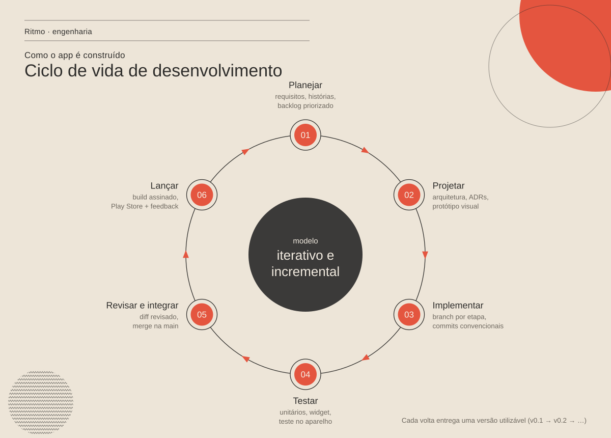
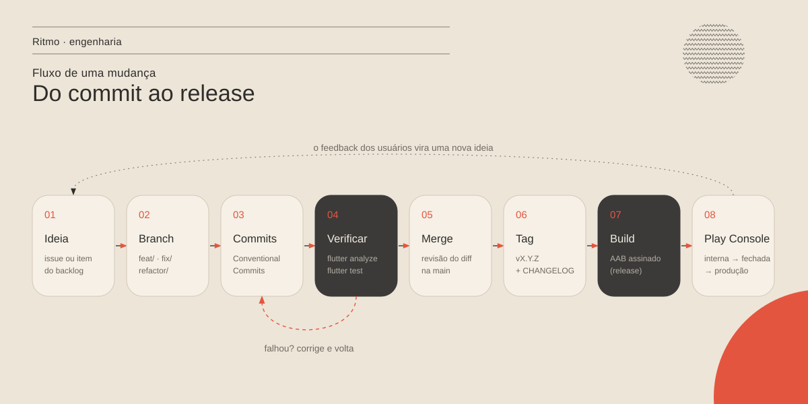
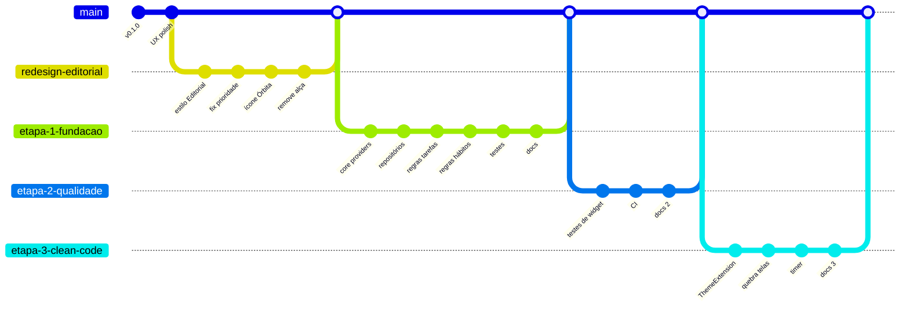

# Ciclo de vida de desenvolvimento

> Como o Ritmo vai da ideia à Play Store, e volta. Projeto individual,
> mas com o processo de um time pequeno: cada mudança é rastreável do
> requisito ao commit e à versão publicada.

## 1. Modelo: iterativo e incremental

O app evolui em **voltas curtas**. Cada volta passa pelas seis fases e termina
com uma versão utilizável (v0.1 → v0.2 → …). Não há um "grande design" no
começo: o PRD define a direção, e cada iteração detalha só o que vai ser
construído nela. O quadro de trabalho segue Kanban (A fazer → Fazendo →
Revisão → Feito), sem sprints fixos — adequado para uma pessoa com tempo
variável.

| Fase | Pergunta | Artefatos | Onde fica |
| --- | --- | --- | --- |
| 01 Planejar | O que resolve o problema do usuário agora? | PRD, requisitos (RF/RNF), backlog priorizado | [`PRD.md`](../PRD.md), docs por funcionalidade |
| 02 Projetar | Como encaixa na arquitetura? Como vai parecer? | Decisões (ADRs), diagramas, protótipo visual | [`adr/`](../adr/README.md), [`arquitetura.md`](../arquitetura.md), [`design.md`](../design.md) |
| 03 Implementar | Qual a menor mudança que entrega valor? | Branch + commits convencionais | GitHub |
| 04 Testar | Funciona e continua funcionando? | Testes automatizados, roteiro manual | [`qualidade/testes.md`](../qualidade/testes.md), `test/` |
| 05 Revisar e integrar | O diff está claro e consistente? | Revisão do diff, merge na `main` | histórico do git |
| 06 Lançar | Como chega ao usuário? | Tag, CHANGELOG, AAB assinado, notas da versão | `CHANGELOG.md`, Play Console |

O feedback de quem usa (avaliações, bugs, uso próprio) volta como itens do
backlog — e a próxima volta começa.

## 2. Do commit ao release

### Branches

`main` é sempre um estado que compila e pode virar release. Todo trabalho
acontece em uma branch curta, com prefixo do tipo de mudança:

| Prefixo | Uso | Exemplo |
| --- | --- | --- |
| `feat/` | Funcionalidade nova | `feat/lembretes-de-habito` |
| `fix/` | Correção de bug | `fix/recorrente-concluida` |
| `refactor/` | Mudança de estrutura sem mudar comportamento | `refactor/etapa-1-fundacao` |
| `docs/` | Só documentação | `docs/requisitos` |
| `chore/` | Build, dependências, configuração | `chore/ci-github-actions` |

Histórico real das últimas iterações:

### Commits: Conventional Commits

Formato `tipo(escopo): descrição no imperativo`, corpo explicando o **porquê**.

| Tipo | Quando | Efeito na versão |
| --- | --- | --- |
| `feat` | nova funcionalidade | MINOR |
| `fix` | correção de bug | PATCH |
| `refactor` | reorganização sem mudar comportamento | — |
| `perf` | melhoria de desempenho | PATCH |
| `test` | testes | — |
| `docs` | documentação | — |
| `chore` / `build` / `ci` | infraestrutura | — |
| `feat!` ou `BREAKING CHANGE:` | quebra compatibilidade (ex.: formato de dados sem migração) | MAJOR |

### Versionamento

`pubspec.yaml` usa `version: MAJOR.MINOR.PATCH+BUILD`
([SemVer](https://semver.org/lang/pt-BR/)). O `BUILD` (o `versionCode` do
Android) **sempre aumenta** a cada envio à Play Store, mesmo que a versão
visível não mude. Cada release recebe uma tag `vX.Y.Z` e uma seção no
[`CHANGELOG.md`](../../gestao_pessoal/CHANGELOG.md) no formato
[Keep a Changelog](https://keepachangelog.com/pt-BR/1.1.0/).

## 3. Critérios de pronto

**Pronto para começar** (Definition of Ready) — um item do backlog só entra
em "Fazendo" quando:
- o problema do usuário está descrito em uma frase;
- há critérios de aceite verificáveis;
- se mexe na arquitetura, há um ADR proposto.

**Pronto** (Definition of Done) — uma mudança só vai para a `main` quando:
- [ ] CI verde (`flutter analyze` sem erros/avisos e `flutter test` passando);
- [ ] teste novo para regra nova ou bug corrigido;
- [ ] testada no aparelho nos dois estilos visuais (Editorial e Liquid Glass);
- [ ] commits no padrão, diff revisado;
- [ ] documentação afetada atualizada (ADR, arquitetura, CHANGELOG).

## 4. Processo de release (Android)

1. Atualizar `version` no `pubspec.yaml` (incrementando o `+BUILD`).
2. Mover as entradas de `[Não lançado]` para a nova versão no CHANGELOG.
3. Gerar o pacote assinado: `flutter build appbundle --release`
   (chave de upload fora do repositório, referenciada por `key.properties`).
4. Criar a tag: `git tag v0.2.0 && git push origin v0.2.0`.
5. Play Console: faixa **teste interno** → **teste fechado** → **produção**,
   com notas da versão em português.
6. Acompanhar falhas e avaliações; o que surgir vira item do backlog.

## 5. Ferramentas

| Necessidade | Ferramenta |
| --- | --- |
| Código e versionamento | Git + GitHub |
| Framework | Flutter (Dart 3) |
| Estado | Riverpod |
| Testes | `flutter_test` |
| Integração contínua | GitHub Actions ([`ci.yml`](../../.github/workflows/ci.yml)) |
| Análise estática | `flutter analyze` + `flutter_lints` |
| Diagramas | Mermaid (renderizado pelo GitHub) e SVG em `docs/assets/` |
| Publicação | Google Play Console |
| Assistência | Claude (revisão de arquitetura, refatoração, documentação) |
