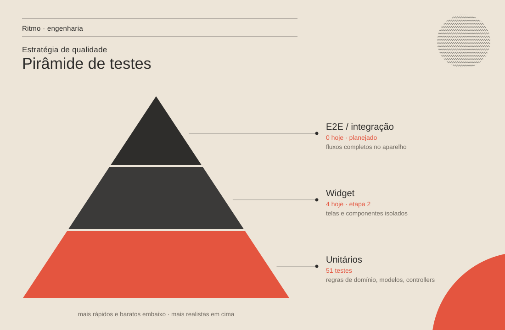

# Estratégia de testes

> O que é testado, como, e por quê. Os testes protegem principalmente as
> **regras de negócio** — é onde moram os bugs que o usuário sente (tarefa
> que não volta, sequência errada, gráfico zerado).



## 1. Pirâmide

| Nível | O que cobre | Velocidade | Hoje | Meta |
| --- | --- | --- | --- | --- |
| **Unitário** | Regras puras do domínio, modelos (JSON e migração), controllers com repositório em memória e relógio falso | milissegundos | 80 | toda regra nova e todo bug corrigido |
| **Widget** | App real (rotas, shell, tema, telas) com armazenamento em memória e data fixa | rápido | 6 | fluxos principais de cada tela |
| **Integração / E2E** | Fluxos completos no aparelho ou emulador (`integration_test`) | lento | 0 | antes da primeira versão na Play Store |

A base larga é intencional: as regras foram extraídas para funções puras
([ADR 0004](../adr/0004-regras-de-dominio-puras.md)) justamente para serem
testadas sem montar interface.

## 2. O que está coberto

| Arquivo | Testes | Protege |
| --- | --- | --- |
| `test/features/tasks/task_schedule_test.dart` | 21 | "é de hoje", tarefas atrasadas, conteúdo de cada aba, painel Hoje, contador de pendentes |
| `test/features/tasks/task_model_test.dart` | 3 | JSON ida e volta; **migração** de recorrentes antigas |
| `test/features/tasks/tasks_controller_test.dart` | 4 | Concluir/desfazer recorrente por dia, persistência via repositório |
| `test/features/habits/habit_rules_test.dart` | 9 | Sequência (dias previstos, quebra, hoje em aberto), dias incompletos |
| `test/features/stats/stats_calculator_test.dart` | 4 | Contagem de conclusões, gráfico semanal e anual, minutos de foco |
| `test/features/pomodoro/pomodoro_cycle_test.dart` | 6 | Próximo modo (pausa longa no 4º foco), "pular", tempo restante arredondado |
| `test/features/pomodoro/pomodoro_controller_test.dart` | 11 | Timer pelo horário de término: segundo plano, pausa, conclusão única, sessão gravada, som, tela acesa |
| `test/features/reminders/reminder_planner_test.dart` | 16 | Quais avisos existem e quando: resumo, pendências, tarefas, hábitos, adiamento, chave geral |
| `test/features/settings/notification_settings_test.dart` | 3 | Padrões e migração das configurações de aviso |
| `test/core/json_coders_test.dart` | 3 | Registros corrompidos não derrubam o app |
| `test/app_test.dart` | 5 | Tela Hoje (progresso e concluir, tarefa atrasada), estado vazio, abas de Tarefas, estilos em Configurações |
| `test/shell/day_rollover_test.dart` | 1 | Virada do dia ao voltar do segundo plano |

**Total: 86 testes** (80 unitários + 6 de widget).

**Testes de regressão:** cada bug corrigido na etapa 1 tem um teste com o
cenário que falhava — por exemplo `gráfico anual soma o mês inteiro (bug
antigo: só o mesmo dia)` e `recorrente feita na terça volta a ficar pendente
na quinta` e, na etapa 3, `segundo plano não atrasa o timer`.

## 3. Convenções

- **Nomes em português, descrevendo o comportamento**, não o método:
  `hoje ainda não feito não quebra a sequência`.
- **Arrange · Act · Assert**: monta os dados, executa uma ação, verifica.
- **Datas fixas.** Nada de `DateTime.now()` em teste. As regras recebem "hoje"
  como parâmetro e o controller lê do `todayProvider`, sobrescrito com
  `thu` (quinta, 01/10/2026) — ver `test/helpers/fixtures.dart`.
- **Tempo controlado.** O timer de foco lê o `clockProvider`; nos testes é um
  `FakeClock` que só anda com `advance(...)`. 25 minutos de foco levam
  milissegundos, sem `sleep` nem espera real.
- **Fakes em vez de mocks.** Repositórios em memória, som silencioso (ou que
  conta toques), tela acesa em memória e relógio falso em
  `test/helpers/fakes.dart`; `testOverrides(today: ...)` isola o app inteiro
  de armazenamento, relógio e plataforma. Sem bibliotecas de mock: os
  contratos são pequenos e o fake fica legível.
- **Testes de widget montam o app real** (`DailyFlowApp`) numa tela de
  celular (390 × 844) e navegam como o usuário: tocam na nav bar, nas abas e
  nos itens.
- **Layout à prova de fonte grande.** O ambiente de teste usa uma fonte de
  glifos quadrados, mais larga que a real; se um texto estoura a linha no
  teste, provavelmente estoura num celular pequeno com fonte aumentada.
  Números grandes usam `FittedBox(fit: BoxFit.scaleDown)`.
- **Fábricas de dados** (`task(...)`, `habit(...)`) com valores padrão;
  cada teste só informa o que importa para ele.
- **Um bug, um teste.** Correção de bug entra junto com o teste que o reproduz.

## 4. Como rodar

```powershell
cd gestao_pessoal
flutter test                     # todos
flutter test test/features/tasks # uma pasta
flutter test --coverage          # gera coverage/lcov.info
```

Para ver a cobertura em HTML (precisa do `lcov`/`genhtml`):

```bash
genhtml coverage/lcov.info -o coverage/html
```

## 5. Integração contínua

[`.github/workflows/ci.yml`](../../.github/workflows/ci.yml) roda a cada push
na `main` e em todo pull request:

| Passo | Comando | Quebra o build? |
| --- | --- | --- |
| Formatação | `dart format --set-exit-if-changed lib test` | não (só aviso) |
| Análise estática | `flutter analyze --no-fatal-infos` | sim, em erros e avisos |
| Regras de arquitetura | `grep`: `core/` sem imports de `features/`; `domain/` sem Riverpod nem armazenamento | sim |
| Testes | `flutter test --coverage` | sim |
| Cobertura | `coverage/lcov.info` publicado como artefato | — |

Lints extras ativos em `analysis_options.yaml`: `unawaited_futures`,
`avoid_dynamic_calls`, `cancel_subscriptions`, `close_sinks`,
`only_throw_errors`, `always_declare_return_types`, `prefer_final_locals`,
`prefer_single_quotes`, `directives_ordering`, `use_super_parameters`,
`avoid_redundant_argument_values`, `unnecessary_await_in_return`.
Aparecem como *info* — guiam a limpeza sem travar o CI.

## 6. Próximos passos

- Testes de widget para Hábitos (calendário) e Foco (iniciar, pausar, pular
  na tela) — o timer já é testável com `FakeClock` desde a etapa 3.
- `integration_test/` com 3 fluxos no emulador: criar hábito e ver a
  sequência; tarefa recorrente que volta no próximo dia; sessão de foco
  que aparece nas Estatísticas.
- Zerar os *infos* do analyzer e então rodar com `--fatal-infos`.
