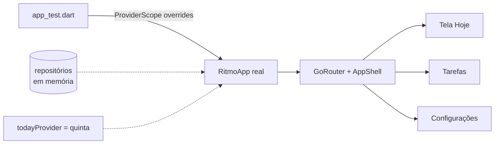

# Etapa 2 — Qualidade

- **Branch:** `chore/etapa-2-qualidade`
- **Objetivo:** fazer a qualidade ser verificada **automaticamente**, não só
  quando alguém lembra de rodar os testes.


## 1. O que entrou

| Item | Antes | Depois |
| --- | --- | --- |
| Integração contínua | nenhuma | GitHub Actions: formatação (aviso), `flutter analyze`, `flutter test` com cobertura |
| Testes | 35 unitários + 1 smoke inútil | 35 unitários + 4 de widget do app real |
| Lints | só `flutter_lints` | + 12 regras ([lista](../qualidade/testes.md#5-integração-contínua)) |
| Artefatos no git | APK de 59 MB versionado | `*.apk` / `*.aab` ignorados |

## 2. Testes de widget

`test/app_test.dart` monta o `RitmoApp` inteiro — rotas, shell, tema
editorial — com `testOverrides(today: quinta)`: repositórios em memória,
data fixa, vibração e som desligados.



| Teste | Garante |
| --- | --- |
| Hoje: progresso e concluir ao tocar | "00 / 02" vira "01" e "faltam 1" — a regra de domínio chegou à tela |
| Hoje: estado vazio | "nada agendado" e o convite "Criar hábito" |
| Tarefas: abas | "Hoje" esconde a tarefa de amanhã; "Concluídas" mostra o estado vazio |
| Configurações: estilos | as opções Editorial e Liquid Glass aparecem |

## 3. Achado de layout

Ao preparar os testes, a simulação com a fonte do ambiente de teste (glifos
quadrados, mais largos que os reais) mostrou que o **"00 / 02"** da tela Hoje
e o número da sequência em Hábitos estouravam a linha em telas de 390 px. O
mesmo aconteceria num celular pequeno com fonte do sistema aumentada.
Correção: `FittedBox(fit: BoxFit.scaleDown)` nos números grandes.

## 4. Como verificar

```powershell
cd gestao_pessoal
flutter analyze --no-fatal-infos
flutter test
```

No GitHub: aba **Actions** → workflow **CI**. O selo no topo do README mostra
o estado da `main`.
