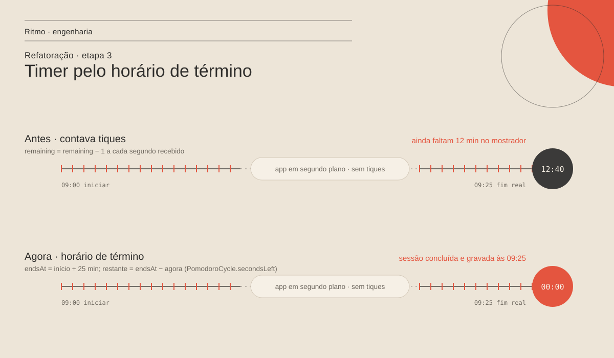
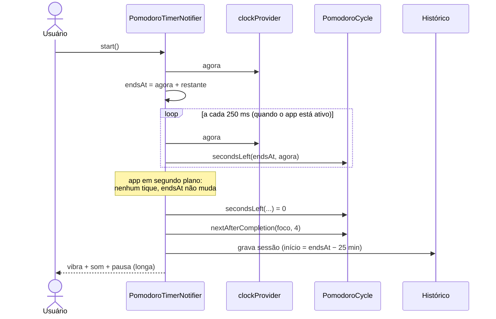

# Etapa 3 — Clean Code

- **Branch:** `refactor/etapa-3-clean-code`
- **Objetivo:** atacar as dívidas que a [revisão de arquitetura](revisao-de-arquitetura.md)
  apontou dentro do código: estado global de cores, telas de mil linhas,
  duplicação, `core/` dependendo de features e o timer de foco que atrasava.

| Item | Antes | Depois | Registro |
| --- | --- | --- | --- |
| Paleta de cores | campo estático global trocado em runtime | `ThemeExtension` lida por `context.palette` | [ADR 0006](../adr/0006-paleta-como-theme-extension.md) |
| Telas grandes | Hábitos 1241, Configurações 992, Tarefas 944 linhas | 178, 354 e 268 + diálogos e widgets pequenos | [seção 2](#2-telas-quebradas) |
| Cor de destaque nas telas | 10 arquivos de 5 features importavam `settings` só para ler a cor | `context.accent`, vinda do tema | [ADR 0008](../adr/0008-shell-fora-do-core.md) |
| Duplicação | 5 conversores hex → cor, 2 seletores de dia da semana, 2 diálogos de exclusão, 2 fundos de deslizar | um de cada, em `core/` | [seção 3](#3-duplicação-removida) |
| `core/` → `features/` | 5 arquivos de `core/` importavam features | nenhum; casca do app em `lib/shell/` | [ADR 0008](../adr/0008-shell-fora-do-core.md) |
| Timer de foco | contava tiques; atrasava em segundo plano | calcula pelo horário de término | [ADR 0007](../adr/0007-timer-pelo-horario-de-termino.md) |
| Dependências | 3 pacotes declarados e nunca usados | removidos; `wakelock_plus` passou a ser usado | [seção 5](#5-dependências) |
| Testes | 39 | 55 (+16 do timer) | [testes](../qualidade/testes.md) |
| Regras de arquitetura | só escritas na documentação | verificadas no CI a cada push | [CI](../qualidade/testes.md#5-integração-contínua) |
| Código morto | `DailyProgressRing` sem nenhum uso | removido | — |

## 1. Paleta como `ThemeExtension`

```mermaid
flowchart LR
  subgraph antes
    U[AppColors.use&#40;style&#41;] -->|muta| S[(campo estático)]
    S --> W1[widget lê AppColors.textPrimary]
    K[AppShell com KeyedSubtree] -.->|recria a árvore<br/>para "ver" a mudança| W1
  end
  subgraph depois
    T[AppTheme.build&#40;style&#41;] -->|extensions: AppPalette| TH[ThemeData]
    TH --> W2[widget lê context.palette.textPrimary]
  end
```

A troca foi mecânica (226 leituras) e feita num commit isolado, para o diff
dos outros commits ficar legível. Onde não havia `BuildContext` — como a cor
de prioridade de uma tarefa — a cor virou parâmetro:
`TaskPriority.colorAt(accent, muted: palette.textTertiary)`.

## 2. Telas quebradas

Critério: **um arquivo, um motivo para mudar** (o "S" do SOLID). A tela fica
com a composição e a navegação; o formulário vira um diálogo próprio; cada
bloco visual que tem nome vira um widget em `presentation/widgets/`.

| Feature | Tela | Extraído para |
| --- | --- | --- |
| Hábitos | `habits_screen.dart` | `habit_form_dialog.dart`, `widgets/habit_card.dart`, `widgets/habit_calendar_card.dart`, `widgets/streak_panel.dart` |
| Tarefas | `tasks_screen.dart` | `task_form_dialog.dart`, `widgets/task_tile.dart`, `widgets/task_filter_tabs.dart` |
| Configurações | `settings_screen.dart` | `widgets/style_preview.dart`, `widgets/color_picker_dialog.dart`, `widgets/settings_tiles.dart` |

Em Configurações, quatro blocos quase idênticos ("cor do papel de parede",
"cor do fundo", "cor do texto", "cor de destaque") viraram um único
`ColorSettingCard` com título, descrição, cor e ação de restaurar.

O maior arquivo restante é `habit_form_dialog.dart` (573 linhas) — um
formulário longo, mas com um motivo só para mudar. Fica sob observação.

## 3. Duplicação removida

| Repetido em | Virou |
| --- | --- |
| `_hexToColor` em tema, configurações, hábito, timer e fundo | `core/utils/color_hex.dart` (`colorFromHex`, `colorToHex`) |
| Seletor de dias da semana em hábitos e tarefas | `core/widgets/weekday_chip.dart` (`WeekdayPicker`) |
| Diálogo "Excluir?" em hábitos e tarefas | `core/widgets/confirm_delete_dialog.dart` |
| Fundo vermelho ao deslizar para excluir | `core/widgets/swipe_delete_background.dart` |

## 4. Timer de foco





Comportamentos corrigidos junto:

- **"Parar"** volta ao tempo cheio do modo (antes só pausava, apesar do
  comentário dizer que zerava).
- **Som e vibração** ao concluir uma sessão — a opção "Som de conclusão"
  prometia isso e não fazia.
- **Tela acesa** enquanto o timer roda (`WakelockService`).
- A sessão gravada fica no horário em que de fato aconteceu, mesmo se o app
  só perceber o fim depois.

Testes (`test/features/pomodoro/`), todos com `FakeClock` — nenhum espera de
verdade:

| Teste | Garante |
| --- | --- |
| focos 1 a 3 → pausa curta, 4º → pausa longa | regra do ciclo |
| pular segue Foco → Pausa curta → Pausa longa → Foco | botão "pular" |
| arredonda para cima / nunca negativo | mostrador só chega a 00:00 no fim |
| segundo plano não atrasa o timer | **o bug que motivou a mudança** |
| pausar congela, retomar continua | pausa não conta tempo |
| ciclo terminado em segundo plano é concluído uma vez só | sem sessão duplicada |
| foco concluído grava, toca som e vai para a pausa curta | efeitos da conclusão |
| parar volta ao tempo cheio, sem gravar | botão "parar" |
| tela acesa só enquanto roda | wakelock liga e desliga |

## 5. Dependências

| Pacote | Situação |
| --- | --- |
| `flutter_local_notifications` | removido — nenhum uso; volta quando houver lembretes |
| `vibration` | removido — a vibração usa `HapticFeedback` do próprio Flutter |
| `flutter_colorpicker` | removido — o seletor usa `flex_color_picker` |
| `wakelock_plus` | mantido e agora usado (tela acesa no foco) |

Menos dependências = APK menor, menos permissões nativas e menos pacotes
para atualizar.

## 6. Como verificar

```powershell
cd gestao_pessoal
flutter pub get
flutter analyze --no-fatal-infos
flutter test
```

No aparelho: iniciar um foco, minimizar o app por alguns minutos e voltar —
o mostrador deve ter descontado o tempo que passou. Trocar entre Editorial e
Liquid Glass em Configurações deve animar as cores sem piscar a tela.
