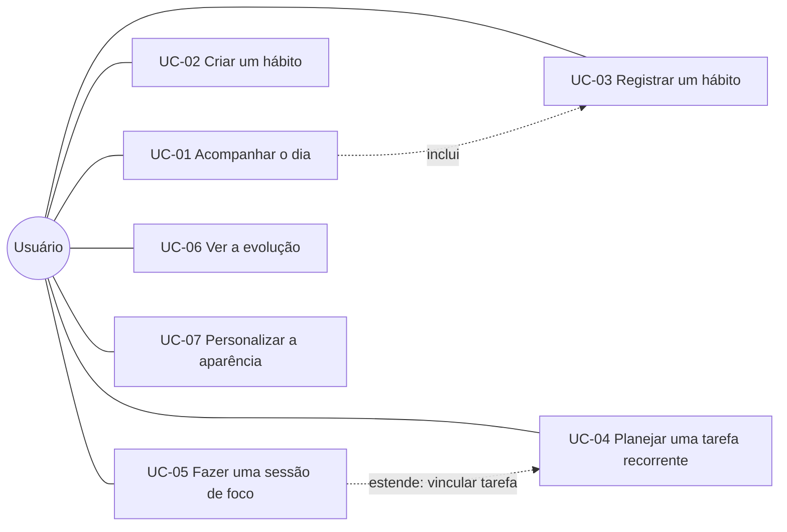

# Casos de uso

> Os caminhos que o usuário percorre no dia a dia. Um só ator: a pessoa dona
> do aparelho. Não há conta, servidor nem outros usuários.

---

## UC-01 — Acompanhar o dia

| | |
| --- | --- |
| **Objetivo** | Saber o que falta hoje e marcar o que foi feito sem trocar de tela |
| **Pré-condição** | — |
| **Requisitos** | RF-DB-01, RF-DB-02, RF-DB-04, RF-DB-05 |

**Fluxo principal**
1. O usuário abre o app; a tela Hoje mostra a saudação, a data e "Feitos hoje".
2. "Hoje no radar" lista os hábitos e as tarefas previstos para o dia.
3. O usuário toca num item; ele fica concluído e o progresso avança.

**Fluxos alternativos**
- *1a. Nada previsto:* a tela mostra "Dia livre por enquanto" e o botão
  **Criar hábito** (→ UC-02).
- *3a. Tocou por engano:* tocar de novo reabre o item.

**Pós-condição:** as conclusões ficam gravadas e aparecem em Hábitos, Tarefas
e Estatísticas.

---

## UC-02 — Criar um hábito

| | |
| --- | --- |
| **Objetivo** | Começar a acompanhar uma rotina |
| **Requisitos** | RF-HB-04, RF-HB-01 |

**Fluxo principal**
1. Em Hábitos, o usuário toca em **+**.
2. Informa o nome, escolhe ícone e cor e marca os dias da semana.
3. Opcionalmente, ajusta meta, unidade, duração estimada e horário.
4. Salva; o hábito aparece na lista dos dias previstos.

**Fluxos alternativos**
- *2a. Nome vazio:* o hábito não é criado.
- *4a. Nenhum dia marcado:* o hábito é salvo, mas não aparece em nenhum dia
  até ser editado.

---

## UC-03 — Registrar um hábito

| | |
| --- | --- |
| **Objetivo** | Marcar que a rotina foi cumprida e manter a sequência |
| **Pré-condição** | Existe ao menos um hábito |
| **Requisitos** | RF-HB-01, RF-HB-02, RF-HB-03, RF-HB-06 |

**Fluxo principal**
1. Em Hábitos, o usuário vê o calendário com o dia de hoje selecionado.
2. Toca no check do hábito; o aparelho vibra, toca o som e a maior sequência
   é recalculada.

**Fluxos alternativos**
- *1a. Esqueceu de marcar ontem:* seleciona o dia no calendário e marca
  nele; a sequência é corrigida.
- *2a. Desistir:* desliza o cartão para a esquerda, confirma a exclusão e
  pode tocar em **Desfazer**.

---

## UC-04 — Planejar uma tarefa recorrente

| | |
| --- | --- |
| **Objetivo** | Ter uma tarefa que volta nos dias certos, sem recriá-la |
| **Requisitos** | RF-TD-01, RF-TD-03, RF-TD-06, RF-TD-07, RF-TD-09 |

**Fluxo principal**
1. Em Tarefas, o usuário toca em **+**, dá um título e marca os dias de
   repetição (ex.: ter a sex).
2. Nos dias marcados, a tarefa aparece em "Hoje" (aba e tela inicial).
3. Ao concluir, ela sai de "Hoje" e vai para "Concluídas" naquele dia.
4. No próximo dia previsto, ela volta pendente.

**Fluxos alternativos**
- *1a. Tarefa pontual:* sem dias de repetição, a tarefa vale para a data
  escolhida; se a data passar sem conclusão, continua em "Hoje" com a marca
  **Atrasada** até ser feita. Depois de concluída, some no dia seguinte.
- *Excluir:* deslizar avisa que todas as ocorrências serão excluídas.

---

## UC-05 — Fazer uma sessão de foco

| | |
| --- | --- |
| **Objetivo** | Trabalhar 25 minutos sem distração e registrar o tempo |
| **Requisitos** | RF-PO-01 a RF-PO-07 |

**Fluxo principal**
1. Em Foco, o usuário opcionalmente vincula uma tarefa pendente.
2. Toca em **Iniciar**; a tela passa a ficar acesa.
3. Ao chegar a 00:00, o aparelho vibra e toca o som, a sessão é gravada e o
   timer prepara a pausa (curta, ou longa a cada 4 focos).

**Fluxos alternativos**
- *2a. Interrupção:* **Pausar** congela o tempo; **Iniciar** retoma.
- *2b. Desistir:* **Parar** volta a 25:00 sem gravar.
- *2c. App minimizado:* o tempo continua contando pelo horário de término; ao
  voltar, o mostrador está certo ou a sessão já aparece concluída.
- *3a. Pular a pausa:* **Pular** vai para o próximo modo sem gravar.

---

## UC-06 — Ver a evolução

| | |
| --- | --- |
| **Objetivo** | Perceber constância e volume de trabalho |
| **Requisitos** | RF-ST-01, RF-ST-02, RF-ST-03 |

**Fluxo principal**
1. Em Estatísticas, o usuário vê tarefas concluídas, minutos de foco e maior
   sequência.
2. Escolhe Semana, Mês ou Ano; o gráfico de barras se ajusta.
3. Confere o mapa das últimas 8 semanas de hábitos.

---

## UC-07 — Personalizar a aparência

| | |
| --- | --- |
| **Objetivo** | Deixar o app com a cara do usuário |
| **Requisitos** | RF-CF-01 a RF-CF-06 |

**Fluxo principal**
1. Na tela Hoje, o usuário toca no ícone de configurações.
2. Escolhe Editorial ou Liquid Glass; o app muda na hora.
3. Ajusta a cor de destaque, as cores do timer e liga ou desliga vibração e
   som.

**Fluxos alternativos**
- *2a. Liquid Glass:* aparecem opções de fundo (gradiente animado ou cor
  sólida) e de cor do texto.
- *3a. Não gostou:* "Restaurar padrões" desfaz as personalizações sem tocar
  nos dados.
